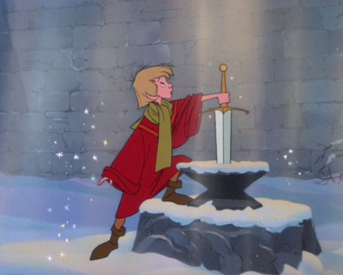
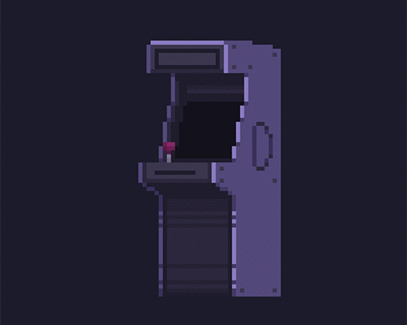
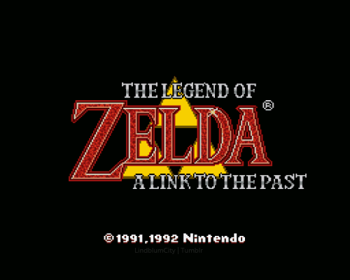
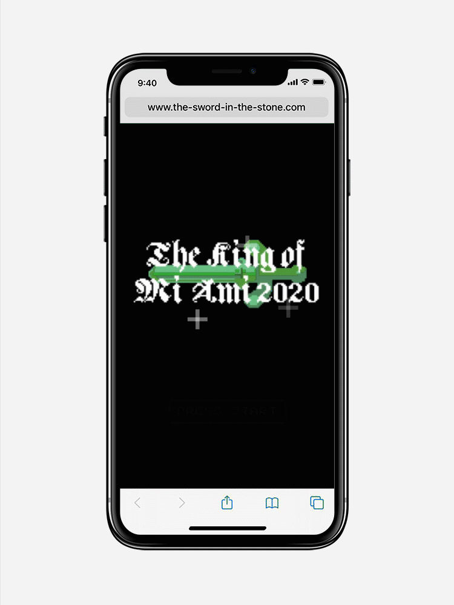
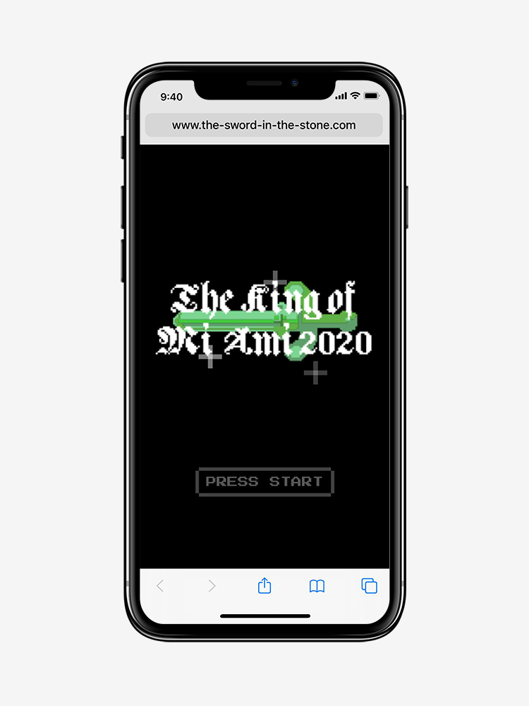
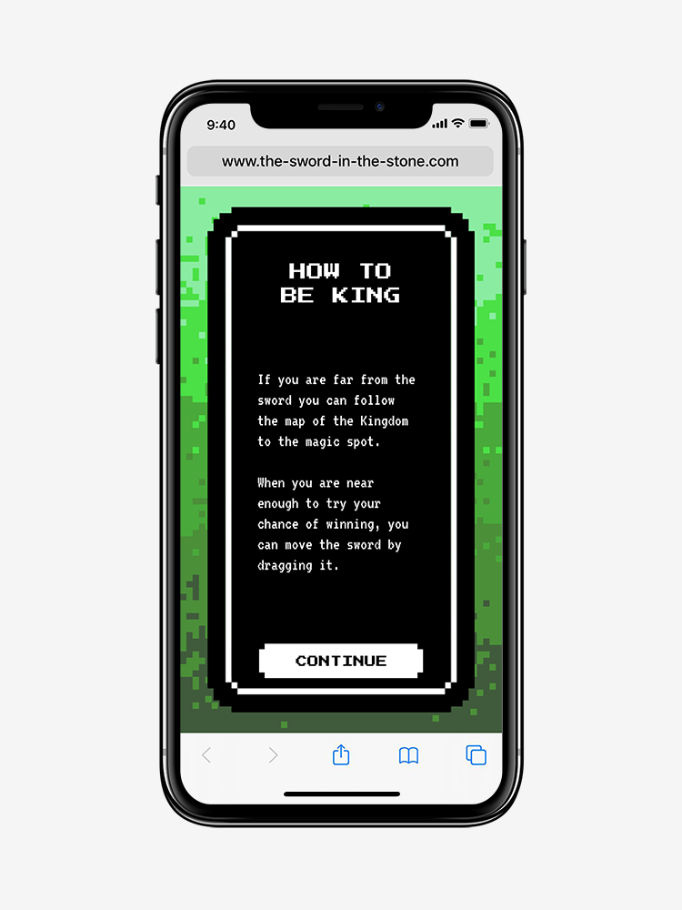
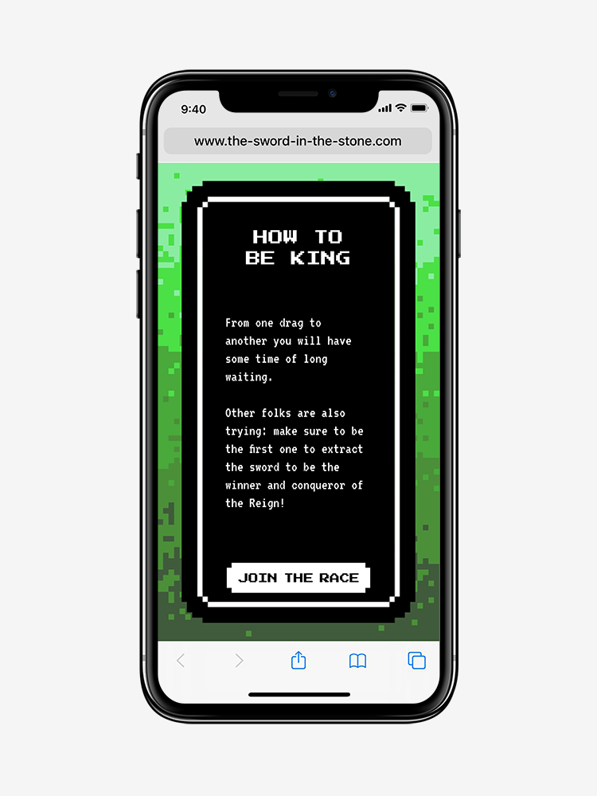
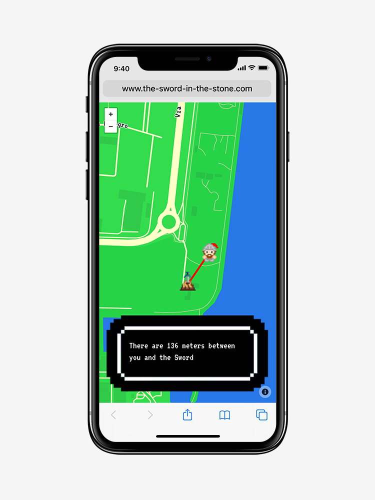

# The King of Mi Ami

Everybody wants to matter. In this mobile game you can win the boredom and a reign both. <br>All you have to do is extract the sword from the stone.

<p align="center">
    
</p>
<br>


## Team Members

Beatrice Bazzan, Giovanni Covre, Francesca Granzotto, Lorenzo Di Leonardo
<br>


## Course Reference - Academic Year

[Creative Coding 2019/2020](https://drawwithcode.github.io/2019/)<br>
Politecnico di Milano - Scuola del Design<br>
Faculty: Michele Mauri, Andrea Benedetti
<br>


## About the Project

###### WHAT IS "KING OF MI AMI"
The King of Mi Ami is inspired by the legend of “The Sword in the Stone”.
Whoever extracts the sword becomes king for a day. This project is designed to be an easy way to escape from the boredom of a long wait and to engage a large number of people in a group game. This project is meant to be played in the context of a festival, in this case the Mi Ami Festival of Milan, where there is the need to entertain a large group of fans before the show begins. Everyone who possesses a smartphone and is located inside a defined area can access the game and can conquer to become the daily king by dragging the legendary sword out of the stone. The sword can be touched only every 10 seconds and in the meanwhile the user can see other gamers’ attempts.  If the sword isn’t touched in 15 seconds, it will go back inside the rock. If a user manages to pull out the sword, he/she is named King of Mi Ami for the current day and can access to the concert backstage or win a free beer. The other users will see an animation in which their defeat is declared, the name of the new king is shown with the invitation to try again the following day.

###### REFERENCES TO THE LEGEND
The project takes inspiration from the well-known story of the sword in the stone, which tells how a young squire became king after extracting the legendary Excalibur sword from a stone altar.
In the original novel, the main character makes three attempts to extract the sword: this detail inspired us to make the game less based on luck and more based on the cunning of the individual player, who uses the movements made by others to achieve victory.
The choice of a widely known story was determined by the need to have a game dynamic and a setting immediately recognizable by the majority of the population.

<p align="center">
    
</p>
<p align="center">
    <em >The Sword in the Stone</em>
</p>
<br>


## Context
###### MI AMI FESTIVAL
[Mi Ami Festival](https://www.miamifestival.it/2020/) Musica Importante A Milano is a music festival organized by Rockit.it since 2005. It takes place every year in a park, currently the Idroscalo of Milan, during the last weekend of May. It hosts Italian artists from a predominantly independent area, alternative, without distinction of musical genre but with a careful musical-cultural selection. MI AMI is the most known summer festival of Milano, and it has an indie vibe and style that aligns perfectly with the mood of our site.

<p align="center">
    
</p>
<p align="center">
    <em >Mi Ami Festival</em>
</p>

At the beginning the project was designed to be placed at PolEATecnico Bistò (ex Bar La Rossa), creating a more local and restricted experience, but something was missing: it's a common game but the common game atmosphere was not really present. The decision was to move to a larger and more populated environment where you can have a large screen to view and play in the community, but without forgetting about the sectorialization: the game brings together people who are already interested in participating in the same experience.

###### THE BIG SCREEN
Thanks to this change of location we can take advantage of the big screen projection of the live game, that will be played in moments of stalemate from the opening of the gates, to the waiting for the singers, allowing everyone to perceive the position of the sword. It became a real group experience, in which the competition is even more present, given that it will appear both the number of the "knight" that are trying to conquer the sword (and the name of the King at the end).

(There will be also a QR code that will appear on the big screen and it will allow to play only by framing it with the phone.)

###### REAL WINNING 
We tought about a collaboration with Mi Ami Festival, and thanks to it there will be a prize that is offered by the sponsor, such as a backstage meeting with the artist, or free beers for the real King of the day. 
<br>


## Design Challenges

Our desire was to make an experience that killed the typical boredom in a queue at the Mi Ami Festival
but also that would be inclusive for everybody, and in order to achieved that we thinked about projecting the challenge in the big screen that the Festival already has.

###### STRATEGIC GAMEPLAY
We tried to make the game increasingly less a lottery, and much more a meritocratic system of strategy, where everyone can try to understand when is the best time to try and swipe the sword and ensure victory. 
Hence three very important choices: 
1. Insert a precision bar within the game screen. This will create a threshold of difficulty, which will allow only the most precise and valiant to raise the sword.
2. Show the number of players in the big screen. 
3. Show a timer in the mobile game screen that allows the gamer to understand how long he has to wait before tapping again. 

###### ARCADE STYLE GRAPHICS
Everything aims to the facility of the gameplay, that has to be intuitive and really easy to follow, in order to make a lot of people play toghether without impediments. This includes the stylistic choice of an arcade game, very easy to follow and with graphics that allows you to play it even in a distracted way.

<p align="center">
    
</p>

###### VISUAL DESIGN
We choose a Pixel Art style, that is almost entirely based on a 51 width pixels grid.
The palette tries to evoque a magic ambience, set into the woods, where the magic sword is stuck. The principal colour is green, that is then declined in shades of the same green, along with some brown shades. 

As for the info and the structure of the game, we used an off-white colour.

<p align="center">
    
</p>
<p align="center">
    <em>The Legend of Zelda</em>
</p>
<br>


## Code Challanges

###### DATABASE
LORENZ

###### DESKTOP AND MOBILE
To understand what kind of device, desktop or mobile, is connected to the game we used if conditions. Through the latter we checked the size of the screen, to then show or hide some elements rather than others or redirect the device to the correct page.
<br>
[Bootstrap](https://getbootstrap.com/docs/4.1/layout/overview/) was used as a reference for the screen width of the devices.

###### PIXEL GRID PHOTO
FRA

###### TEXT BLINK ANIMATION
<p align="center">
    
</p>

To overcome the limitations of p5.js in using text animations, we used the css formatting language to create animations that emulate the classic "PRESS START" command found in many arcade games.

```css
@keyframes blinker {
  0% {
    opacity: 1.0;
  }

  50% {
    opacity: 0.0;
  }

  100% {
    opacity: 1.0;
  }
}
```

## Website experience

In order to do so we divided the experience in different steps:

###### STEP #1
Two screens of brief introduction to the realm and to the rules and instructions to follow in order to play the game

<p align="center">
    
</p>
<p align="center">
    
</p>
<p align="center">
    
</p>

###### STEP #2
Two possibilities:<br>
- if the player is not in the area of "Mi Ami Festival Reign" it will appear a map indicating the distance from the area;<br>
- if the player is in the area on the contrary the game screen will appear, and you can start to play. Here two situations can happen: one where the sword has already been drawn, which will mean that you can try to play again the next day, and one where the sword is still stuck in the rock. You can play in the latter case by swipe.

<p align="center">
    
</p>
<p align="center">
    
</p>

###### STEP #3
The game begins. In between each swipe you will have to wait some seconds, and there will be a timer to indicate this. Also, you will be able to see the other pulling the sword (little craving, huh?). Be careful because if the sword is not touched for some other seconds it will go down completely.

<p align="center">
    
</p>

###### STEP #4
If you lose there will be a very sad animation, where everything goes dark and the leaves will star to fall, like recreating a sad autumn atmosphere. After the animation you will just see the empty rock, but don't lose your hopes: you can always try to win the day after!

<p align="center">
    
</p>

###### STEP #4
If you win it will appear a glorious animation, with a cheerful song. After this, you will be able to take a picture with the crown that you had well deserved, and then also save that victorious picture. There will then be a screen with the actual prize that will be agreed with the sponsor.

<p align="center">
    
</p>
<br>


## Used Libraries and Technologies

- hammer.min.js
- mappa.js
- node.js
- p5.dom.min.js
- p5.geolocation.js
- p5.min.js
- p5.min.sound.js
<br>

## Inspirations and References

###### INSPIRATIONS

- [The Legend of Zelda](https://www.zelda.com)
- [The Sword in the Stone](https://www.youtube.com/watch?v=fugDoXb_nKg)

###### REFERENCES

- [Mr. Shiffman's Tutorials](https://shiffman.net/)
- [OpenProcessing.org](https://www.openprocessing.org/)
- [P5JS.org](https://p5js.org/)
<br>


## References to Theory
We studied and tried to focus on the legend of The Sword in the Stone, along with some researches about traditional videogame, mass competition, wasting time on a queue. Here two useful links:

- <a href="https://www.imdb.com/title/tt0057546/">The Sword in the Stone, Film of Wolfgang Reitherman, 1963</a>
- <a href="https://queue-it.com/blog/psychology-of-queuing/">The 6 Revealing Rules of Queue Psychology</a>
